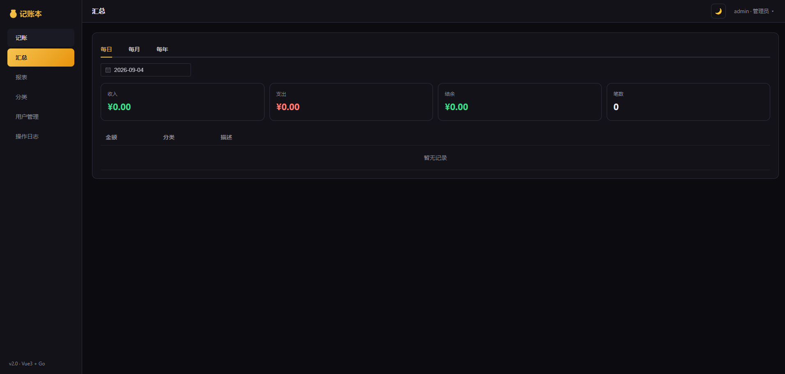

# 记账微服务

基于 Go + Gin + MySQL + Vue 3 的前后端分离记账应用，支持按日期和关键字查询，具备完整的增删改查、汇总、报表与多用户管理。



*记账微服务主界面：支持按日期/关键字查询、分类筛选，并提供日/月/年汇总与报表分析。*

## 技术栈

- **后端**: Go 1.24, Gin, MySQL 5.7（唯一存储，token 黑名单亦存于此）
- **前端**: Vue 3 + Vite（`frontend/`，构建产物 `frontend/dist` 由 Gin 静态托管）
- **测试**: `go test ./...`（单元测试无需外部服务；MySQL 集成测试需 `MYSQL_TEST_DSN`）

## 功能特性

- ✅ **用户认证**：用户名密码登录、TOTP 双因素、refresh token 轮换/服务端撤销、登出
- ✅ 记账记录增删改查、日期范围/关键字查询、服务端排序与分页
- ✅ **分类管理**：自定义收支分类（注册时自动初始化默认分类），记录按分类归集与筛选
- ✅ **每日/每月/每年汇总** 与 **自定义区间报表**（按日/按月/按分类）
- ✅ 报表导出为 PDF / 图片
- ✅ 多用户 + 管理员：用户管理、操作日志、登录日志（审计）
- ✅ 结构化访问日志（request-id 贯穿）、/healthz /readyz 探针、优雅关闭

## 快速开始

### 方式一：Docker Compose（推荐）

```bash
# 1. 准备环境变量
cp .env.example .env
#    编辑 .env，至少填写：JWT_SECRET、MYSQL_ROOT_PASSWORD、MYSQL_USER、MYSQL_PASSWORD
#    （用 openssl rand -base64 48 生成随机密钥）

# 2. 启动（Docker 构建阶段会自动编译后端并构建前端）
docker compose up -d --build

# 3. 访问
open http://localhost:8081/app/
```

首次访问会跳转登录页；**无用户时可「注册」，首个用户自动成为管理员**，之后注册关闭。

### 方式二：拉取现成镜像运行（无需构建，适合部署）

镜像已发布到 Docker Hub：`jacknotes/account-service`（多阶段构建，含前后端，约 31MB）。

```bash
# 1. 拉取镜像（大陆网络可用加速器，见下方说明）
docker pull jacknotes/account-service:v2
docker pull mysql:5.7

# 2. 准备 compose 与环境变量（无需项目源码，仅需 docker-compose.yml、scripts/init-mysql.sql、.env）
#    .env 至少包含：JWT_SECRET、MYSQL_ROOT_PASSWORD、MYSQL_USER、MYSQL_PASSWORD

# 3. 启动（镜像已存在时 compose 不会触发构建）
docker compose up -d

# 4. 访问（端口以 compose 中 ports 映射为准，如 15002:8081）
open http://localhost:15002/app/
```

> - 若 compose 保留了 `build: .`，本地无源码时执行 `docker compose up -d --no-build`，或直接删掉 `build:` 行。
> - **大陆拉取加速**：个人镜像 `hub.rat.dev` 前缀实测可用，官方镜像 `docker.m.daocloud.io` 可用：
>   ```bash
>   docker pull hub.rat.dev/jacknotes/account-service:v2 && docker tag hub.rat.dev/jacknotes/account-service:v2 jacknotes/account-service:v2
>   docker pull docker.m.daocloud.io/library/mysql:5.7 && docker tag docker.m.daocloud.io/library/mysql:5.7 mysql:5.7
>   ```
>   公益加速器可用性会波动；离线机器可直接 `docker save jacknotes/account-service:v2 mysql:5.7 | gzip > images.tar.gz`，目标机 `docker load` 导入。

### 方式三：本地开发

```bash
# 1. 启动基础依赖（仅开发用；若本机 3306 被占用（如 VMware NAT），叠加 override 映射到 3307）
docker compose -f docker-compose.infra.yml -f docker-compose.infra.override.yml up -d

# 2. 构建前端
cd frontend && npm install && npm run build && cd ..

# 3. 配置并启动后端（端口按上一步实际映射调整：3306 或 3307）
export MYSQL_DSN='account:account123456@tcp(127.0.0.1:3307)/account_service?parseTime=true&charset=utf8mb4&loc=Local'
export JWT_SECRET='your-random-secret-at-least-32-chars'
go run main.go
```

> 数据库表结构由应用启动时的**版本化迁移**自动创建（`internal/database/database.go`），无需手动建表。

### 前端开发模式（热更新）

```bash
cd frontend && npm install && npm run dev
```

Vite 默认端口 5173 直连 `/api` 需要代理配置；推荐直接用 `npm run build` 后用 Gin 托管 dist 联调。

## 环境变量

| 变量 | 说明 | 默认值 |
|------|------|--------|
| MYSQL_DSN | MySQL 连接串（**必填**） | - |
| JWT_SECRET | JWT 签名密钥（**必填**，≥32 位） | - |
| PORT | 服务端口 | 8081 |
| FRONTEND_DIR | 前端静态目录 | ./frontend/dist |
| ALLOWED_ORIGINS | CORS 允许域名（逗号分隔，`*` 为全部） | `*` |
| TRUSTED_PROXIES | 可信反代 IP（逗号分隔）。**反代后必须设置**，否则限流/登录锁定按反代 IP 计数 | 空 |
| HTTP_READ_TIMEOUT / HTTP_WRITE_TIMEOUT / HTTP_IDLE_TIMEOUT | HTTP 超时 | 10s / 10s / 60s |

## TLS / 反向代理

默认 HTTP。生产建议 Nginx/Traefik 反代做 HTTPS 终止，并把代理 IP 写入 `TRUSTED_PROXIES`。
示例 Nginx：

```nginx
server {
    listen 443 ssl;
    server_name your-domain.com;
    ssl_certificate     /path/to/cert.pem;
    ssl_certificate_key /path/to/key.pem;

    location / {
        proxy_pass http://127.0.0.1:8081;
        proxy_set_header Host $host;
        proxy_set_header X-Real-IP $remote_addr;
        proxy_set_header X-Forwarded-For $proxy_add_x_forwarded_for;
        proxy_set_header X-Forwarded-Proto $scheme;
    }
}
```

> 若 TRUSTED_PROXIES 未配置，`c.ClientIP()` 将取直连 IP；反代后所有请求会显示为代理 IP，
> 全局限流与登录锁定会退化为“对代理 IP 计数”，安全防护失效。

## API 接口

**认证**
| 方法 | 路径 | 说明 |
|------|------|------|
| GET | /api/auth/register/status | 是否允许注册 |
| POST | /api/auth/register | 注册（仅当无用户时可用） |
| POST | /api/auth/login | 登录（启用 TOTP 时需再提交验证码） |
| POST | /api/auth/refresh | 用 refresh token 换发新 token（**轮换制**） |
| POST | /api/auth/logout | 退出登录（撤销 refresh token，需认证） |
| GET | /api/auth/me | 当前用户（需认证） |
| POST | /api/auth/change-password | 修改密码（需认证，改后全部会话失效） |
| GET | /api/auth/users | 用户列表（管理员） |
| POST | /api/auth/users | 添加用户（管理员） |
| GET | /api/auth/users/:id | 获取用户（管理员） |
| PUT | /api/auth/users/:id | 更新用户（管理员） |
| DELETE | /api/auth/users/:id | 删除用户（管理员，级联删除其数据） |
| POST | /api/auth/users/:id/change-password | 管理员改密（管理员） |
| GET | /api/auth/operation-logs | 操作日志（管理员，支持 user_id、action 筛选） |
| GET | /api/auth/totp/setup | 获取 TOTP 密钥/二维码（需认证） |
| POST | /api/auth/totp/enable | 启用 TOTP（需认证） |
| POST | /api/auth/totp/disable | 关闭 TOTP（需认证） |

**记账（均需认证，数据按用户隔离）**
| 方法 | 路径 | 说明 |
|------|------|------|
| GET | /api/records | 查询列表（start_date, end_date, keyword, sort_field, sort_dir, page, page_size） |
| GET | /api/records/:id | 获取单条记录 |
| POST | /api/records | 创建记录 |
| PUT | /api/records/:id | 更新记录（部分更新） |
| DELETE | /api/records/:id | 删除记录 |

**分类（均需认证，数据按用户隔离）**
| 方法 | 路径 | 说明 |
|------|------|------|
| GET | /api/categories | 分类列表（按 type 筛选：income/expense） |
| POST | /api/categories | 创建分类（name + type，同用户同名同类型唯一） |
| DELETE | /api/categories/:id | 删除分类（不影响已有记录的分类文本） |

**汇总与报表（均需认证）**
| 方法 | 路径 | 说明 |
|------|------|------|
| GET | /api/summary/daily?date= | 每日汇总 |
| GET | /api/summary/monthly?year=&month= | 每月汇总 |
| GET | /api/summary/yearly?year= | 每年汇总 |
| GET | /api/report?start_date=&end_date= | 报表（按日、按月、按分类） |

### 金额字段说明

为避免浮点精度问题，**所有金额使用“分”为单位的整数**，字段名为 `amount_cents` / `income_cents` / `expense_cents` / `balance_cents` / `total_cents`。正数表示收入，负数表示支出（支出汇总为正值）。

```json
POST /api/records
{
  "date": "2024-02-06",
  "amount_cents": -2550,   // -25.50 元
  "category": "餐饮",
  "description": "午餐"
}
```

```json
GET /api/records?start_date=2024-01-01&end_date=2024-12-31&keyword=餐饮&sort_field=date&sort_dir=desc&page=1&page_size=20
```

### 认证流程

1. 登录返回 `access_token`（15 分钟）与 `refresh_token`（7 天）。
2. 前端在 access_token 过期（401）时自动调 `/api/auth/refresh` 换新，**旧 refresh token 即刻失效**（轮换）。
3. 登出或修改密码会撤销服务端的 refresh token，已签发的 access token 也会被加入黑名单（存 MySQL，15 分钟内失效）。

## 项目结构

```
├── main.go                    # 入口：路由、中间件、静态托管
├── config/config.go           # 环境变量配置
├── internal/
│   ├── database/              # MySQL 数据访问 + 版本化迁移
│   ├── handlers/              # API 处理器（含输入校验）
│   ├── middleware/            # 认证、限流、request-id/访问日志
│   ├── models/                # 数据模型
│   └── service/               # 服务接口
├── frontend/                  # Vue 3 + Vite 前端（构建产物 dist/）
├── scripts/init-mysql.sql     # 数据库初始化（仅建库）
├── Dockerfile / docker-compose*.yml
├── docs/middleware.md         # 中间件选型建议
└── .trae/skills/              # 可复用脚手架 SKILL（搭建同类项目）
```

## 复用本工程脚手架（搭建同类项目）

本仓库沉淀了一套 **Go + Gin + MySQL + Vue3 + Element Plus** 全栈 CRUD 项目的可运行骨架与踩坑要点，封装为 SKILL：

```
.trae/skills/go-vue-crud-scaffold/
```

它覆盖目录分层、多阶段 Dockerfile、docker-compose 部署约定（固定网段/TZ/端口收敛/镜像 tag）、认证安全（bcrypt/JWT 轮换/金额用分）、反代真实 IP（TRUSTED_PROXIES）等最佳实践。

**用法**：对 AI 说「按 go-vue-crud-scaffold 搭一个 XX 应用骨架」，或「像这个项目搭一个类似的」，即可据此生成同类项目基础结构。详情见 `docs/middleware.md` 与各文件内注释。

## 测试

```bash
# 单元测试（无需外部服务）
go test ./...

# MySQL 集成测试（可选，需一个可用的 MySQL，测试会 TRUNCATE 相关表！）
MYSQL_TEST_DSN='account:password@tcp(127.0.0.1:3306)/account_service?parseTime=true&charset=utf8mb4&loc=Local' go test ./internal/database/...
```

## 安全要点

- 密码 bcrypt（拒绝 >72 字节，避免静默截断）；强制强度：8 位 + 大小写 + 数字 + 特殊字符
- 所有 SQL 参数化；LIKE 关键字转义；排序字段白名单
- 数据按 `user_id` 严格隔离，记录表与用户表建立外键（删除用户级联删除其数据）
- refresh token 存 SHA-256 哈希并支持轮换/撤销；密码修改后强制下线全部会话
- access token 黑名单存 MySQL；限流为单实例内存令牌桶（多实例如需共享限流状态，可另接外部限流网关）

## 部署运维

### Docker 栈

```bash
docker compose up -d --build      # 构建并启动（MySQL 5.7 + 应用）
docker compose ps                 # 查看状态
docker compose logs -f account-service   # 应用日志
docker compose down               # 停止（数据保留在卷中）
```

- 数据持久化于命名卷 `mysql_data`，`docker compose down` 不会丢数据
- 健康检查：`GET /healthz`（存活）、`GET /readyz`（MySQL 就绪）

### 数据迁移（导入 dump 到新环境）

```bash
# 1. 备份（在源机器执行，--single-transaction 保证一致性快照）
docker exec account-mysql mysqldump -uaccount -p'密码' --default-character-set=utf8mb4 \
  --single-transaction --skip-lock-tables account_service > backups/account_service_$(date +%Y%m%d).sql

# 2. 导入（在目标机器执行，需 MySQL 已 healthy 且库为空——dump 含建表语句与全部数据）
docker exec -i account-mysql mysql -uaccount -p'密码' account_service < backups/account_service_YYYYMMDD.sql
```

> dump 包含 `schema_migrations` 版本记录，导入后应用启动不会重复建表；用户密码哈希一并迁移，用原账号密码登录。

### 管理员密码重置（忘记密码时）

密码为 bcrypt 单向哈希存储，**无法找回，只能重置**。系统未提供自助重置通道（管理员改密接口需先登录），需直接改数据库：

```bash
# 1. 生成新密码的 bcrypt 哈希（密码须满足强度规则：≥8 位 + 大小写 + 数字 + 特殊字符）
python3 -c "import bcrypt; print(bcrypt.hashpw(b'NewP@ssw0rd', bcrypt.gensalt(10)).decode())"
#    或：htpasswd -bnBC 10 "" 'NewP@ssw0rd' | tr -d ':\n'   （需 apache2-utils）

# 2. 更新数据库中的哈希
docker exec account-mysql mysql -uaccount -p'数据库密码' account_service -e \
  "UPDATE users SET password_hash='<第1步生成的哈希>' WHERE username='admin';"

# 3.（建议）清除该用户全部 refresh token，强制旧会话下线
docker exec account-mysql mysql -uaccount -p'数据库密码' account_service -e \
  "DELETE FROM refresh_tokens WHERE user_id=(SELECT id FROM users WHERE username='admin');"
```

> 直接改库不会走应用的改密流程，已签发的 15 分钟内 access token 无法批量拉黑（会自然过期）；
> 若登录时提示"过于频繁"，是连续失败触发的账号锁定（5 次锁 5 分钟，存应用内存），等待或重启应用容器即可。

### 反向代理与真实 IP（TRUSTED_PROXIES）

应用部署在 Nginx 后时，`TRUSTED_PROXIES` 决定 `c.ClientIP()` 是否采信 `X-Forwarded-For` 头。**常见坑**：

- Nginx 部署在宿主机、应用在容器里时，应用看到的直连来源是 **Docker 网桥网关 IP**（如 `172.20.0.1`），不是 `127.0.0.1`。
  配置 `TRUSTED_PROXIES=127.0.0.1` 无效，应填网关 IP。
- 网段由 Docker 动态分配，`compose down` 重建网络后可能变化导致配置失效。建议固定网段：
  ```yaml
  networks:
    account-net:
      driver: bridge
      ipam:
        config:
          - subnet: 172.28.0.0/24
            gateway: 172.28.0.1
  ```
  然后 `TRUSTED_PROXIES=172.28.0.1`。
- Nginx 需传递真实 IP 头：`proxy_set_header X-Real-IP $remote_addr; proxy_set_header X-Forwarded-For $proxy_add_x_forwarded_for;`
- 配错时的症状：登录/操作日志全部记录同一内网 IP、不同用户共享限流配额易触发 429。

### 自动启动（Windows + WSL2 环境）

本机以 WSL2（Ubuntu 24.04）运行 Docker。**WSL 未启用 systemd**（PID 1 为 init），Docker daemon 与应用栈需手动拉起：

```bash
# WSL 重启后 Docker daemon 不会自启，先启动 daemon
sudo service docker start

# 再拉起应用栈
cd /mnt/f/project/account-service && docker compose up -d
```

如需开机自启，可选方案：
- 在 `/etc/wsl.conf` 的 `[boot]` 段设置 `systemd=true` 后启用 systemd 服务
- 或在 Windows 启动目录放一个 `.cmd` 脚本执行
  `wsl -d Ubuntu-24.04 -u root -e sh -c "service docker start && cd /mnt/f/project/account-service && docker compose up -d"`

> 提示：
> - WSL 重启后 IP 可能变化，若后端直连 WSL 内 MySQL（不走容器网络），需同步更新 `MYSQL_DSN`。
> - Docker 镜像加速：本机 `/etc/docker/daemon.json` 配置了可用镜像源（`docker.1panel.live`、`docker.m.daocloud.io`）。

## 变更日志

### 未发布（当前工作区）

- **存储**：移除 SQLite 与 Redis，统一为 **MySQL 5.7**（唯一存储）。
  - token 黑名单整合进 MySQL（新增 `token_blacklist` 表，替代原 Redis 方案）
  - 移除 go-redis 依赖与 `internal/cache` 包；限流 / 登录锁定 / TOTP 计数改为单实例内存实现
- **数据模型**：金额改为整数「分」（`amount_cents`），杜绝浮点精度问题
- **迁移**：引入版本化迁移（`schema_migrations`），建表、外键、旧库字段升级统一由应用管理；删除用户级联删除其数据
- **认证安全**：
  - refresh token 改为不透明随机串 + 服务端轮换/撤销（旧 token 即刻失效）
  - 新增 `POST /api/auth/logout`；登出/改密后 access token 进黑名单
  - 新增 `TRUSTED_PROXIES` 支持反代；输入校验（日期/长度/密码 8~72 字节含复杂度）
- **可观测性**：request-id 贯穿 + 结构化访问日志
- **分类管理**：新增 `categories` 表与 API（列表/创建/删除），注册时自动初始化默认分类；前端新增分类管理页面
- **数据迁移**：旧版 SQLite（`accounting.db`）数据已迁入 MySQL（金额元→分、归属 admin、分类按收支方向推导入库）
- **前端**：整体重构为 Vue 3 + Vite（移除 CDN 依赖，排序/分页服务端化，401 自动续期）
- **部署**：Dockerfile 升级 Go 1.24 + 前端构建阶段；compose 升级 mysql:5.7、去除默认弱口令、收敛端口；应用容器增加 `TZ=Asia/Shanghai`；`.dockerignore` 排除备份/文档等本地目录，`backups/`（mysqldump 产物）加入 `.gitignore`
- **测试**：handler 测试改为内存 fakes（无需数据库）；MySQL 集成测试以 `MYSQL_TEST_DSN` 门控；新增配置/黑名单/refresh 轮换测试

### 历史

早期版本为基于 SQLite 的单机记账应用，具备：用户认证（可选 TOTP）、记账增删改查、按日期/关键字查询、日/月/年汇总、报表导出（PDF/图片）、多用户与管理员用户管理/操作日志。
